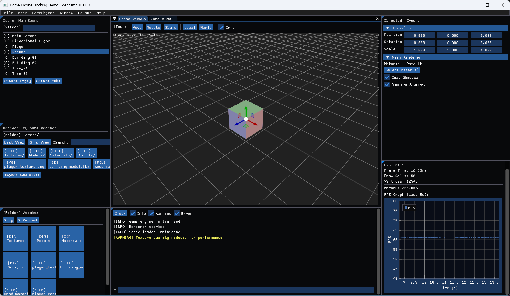

# Dear ImGui Rust Bindings

A Rust binding for [Dear ImGui](https://github.com/ocornut/imgui) with docking support and modern Rust ecosystem integration.



## Overview

This project provides Rust bindings for Dear ImGui, focusing on:

- **API Compatibility**: Designed to be compatible with [imgui-rs](https://github.com/imgui-rs/imgui-rs) API patterns
- **Docking Support**: Built with Dear ImGui's docking branch for advanced window management
- **Modern Dependencies**: Uses current Rust ecosystem versions (wgpu v26, winit v0.30.12)
- **Type Safety**: Safe Rust wrappers around the C++ Dear ImGui library
- **Cross-Platform**: Supports Windows, Linux, and macOS

## Crates

This workspace contains several crates:

- **`dear-imgui`**: High-level safe Rust bindings
- **`dear-imgui-sys`**: Low-level FFI bindings to Dear ImGui C++
- **`dear-imgui-wgpu`**: WGPU renderer backend
- **`dear-imgui-winit`**: Winit platform integration
- **`dear-imgui-glow`**: OpenGL renderer backend (via glow)
- **`dear-imgui-bevy`**: Bevy engine integration

## Quick Start

Add to your `Cargo.toml`:

```toml
[dependencies]
dear-imgui = "0.1"
dear-imgui-wgpu = "0.1"
dear-imgui-winit = "0.1"
wgpu = "26.0"
winit = "0.30.12"
pollster = "0.4"
```

Basic usage with WGPU:

```rust
use dear_imgui::*;
use dear_imgui_wgpu::{WgpuRenderer, WgpuInitInfo};
use dear_imgui_winit::WinitPlatform;

// Create ImGui context
let mut imgui = Context::create();
imgui.set_ini_filename(Some("imgui.ini"));

// Create platform and renderer (one-step initialization)
let mut platform = WinitPlatform::init(&mut imgui);
let init_info = WgpuInitInfo::new(device, queue, surface_format);
let mut renderer = WgpuRenderer::new(init_info, &mut imgui)?;

// Alternative: Two-step initialization for advanced usage
// let mut renderer = WgpuRenderer::empty();
// renderer.init_with_context(init_info, &mut imgui)?;

// In your main loop
let ui = imgui.frame();
ui.window("Hello World")
    .size([300.0, 100.0], Condition::FirstUseEver)
    .build(|| {
        ui.text("Hello, world!");
        if ui.button("Click me") {
            println!("Button clicked!");
        }
    });

// Render
let draw_data = imgui.render();
renderer.render(&draw_data, /* ... */);
```

Basic usage with OpenGL:

```rust
use dear_imgui::*;
use dear_imgui_glow::GlowRenderer;
use dear_imgui_winit::WinitPlatform;

// Create ImGui context
let mut imgui = Context::create();
imgui.set_ini_filename(Some("imgui.ini"));

// Create platform and renderer (handles initialization automatically)
let mut platform = WinitPlatform::init(&mut imgui);
let mut renderer = GlowRenderer::new(gl_context, &mut imgui)?;

// In your main loop
let ui = imgui.frame();
ui.window("Hello World")
    .size([300.0, 100.0], Condition::FirstUseEver)
    .build(|| {
        ui.text("Hello, world!");
        if ui.button("Click me") {
            println!("Button clicked!");
        }
    });

// Render
let draw_data = imgui.render();
renderer.render(&draw_data, /* ... */);
```

## Examples

The `examples/` directory contains several demonstrations:

- **`wgpu_basic.rs`**: Basic WGPU integration
- **`glow_basic.rs`**: OpenGL integration via glow
- **`game_engine_docking.rs`**: Complex docking layout example

Run an example:

```bash
cargo run --example wgpu_basic
cargo run --example game_engine_docking
```

## Installation

Add this to your `Cargo.toml`:

```toml
[dependencies]
dear-imgui = "0.1"
dear-imgui-wgpu = "0.1"  # For WGPU backend
dear-imgui-winit = "0.1" # For Winit integration
```

Or for OpenGL support:

```toml
[dependencies]
dear-imgui = "0.1"
dear-imgui-glow = "0.1"  # For OpenGL backend
dear-imgui-winit = "0.1" # For Winit integration
```

## Features

- **Docking**: Advanced window docking and layout management
- **Tables**: Powerful table widget with sorting and filtering
- **Input Widgets**: Text input, sliders, drag controls, color pickers
- **Layout**: Flexible layout system with groups, columns, and custom positioning
- **Drawing**: Custom drawing with DrawList API
- **Fonts**: Font loading and management
- **Styling**: Comprehensive theming and styling system

## Architecture

### FFI Layer (`dear-imgui-sys`)

The FFI layer uses `bindgen` to generate Rust bindings directly from Dear ImGui C++ headers. We handle C++ ABI compatibility issues (particularly on MSVC) using techniques learned from [easy-imgui-rs](https://github.com/rodrigorc/easy-imgui-rs/):

- Platform-specific wrapper functions for problematic return types
- Conditional compilation for MSVC ABI fixes
- Type-safe conversions between C++ and Rust types

### Safe Layer (`dear-imgui`)

The high-level API provides:

- Memory-safe wrappers around raw FFI calls
- Builder patterns for complex widgets
- RAII-style resource management with tokens
- Type-safe enums and bitflags

### Backends

- **WGPU**: Modern graphics API integration
- **Winit**: Cross-platform windowing
- **Glow**: OpenGL compatibility layer
- **Bevy**: Game engine integration

## Acknowledgments

This project builds upon the excellent work of several other projects:

- **[Dear ImGui](https://github.com/ocornut/imgui)** by Omar Cornut - The original C++ immediate mode GUI library
- **[imgui-rs](https://github.com/imgui-rs/imgui-rs)** - Provided the API design patterns and inspiration for the Rust binding approach
- **[easy-imgui-rs](https://github.com/rodrigorc/easy-imgui-rs/)** by rodrigorc - Demonstrated solutions for C++ ABI compatibility issues and MSVC fixes that we adapted for our FFI layer
- **[imgui-wgpu-rs](https://github.com/Yatekii/imgui-wgpu-rs/)** - Provided reference implementation for WGPU backend integration

## License

This project is licensed under MIT OR Apache-2.0.

- Apache License, Version 2.0 (<http://www.apache.org/licenses/LICENSE-2.0>)
- MIT license (<http://opensource.org/licenses/MIT>)

### Development Setup

```bash
git clone https://github.com/Latias94/dear-imgui
cd dear-imgui
git submodule update --init --recursive
cargo build
cargo test
cargo run --example wgpu_basic
```

## Comparison with imgui-rs

While we aim for API compatibility with imgui-rs, there are some differences:

**Advantages:**

- Built with Dear ImGui's docking branch
- Uses modern Rust ecosystem versions
- Direct C++ FFI (no cimgui dependency)
- Comprehensive MSVC ABI compatibility fixes

**Current Limitations:**

- Still in active development
- Some advanced features not yet implemented
- Smaller ecosystem compared to imgui-rs

Choose imgui-rs if you need a mature, stable solution with extensive ecosystem support. Choose dear-imgui if you want docking support, modern dependencies, or want to contribute to an actively developed project.

## Technical Details

### MSVC ABI Compatibility

One of the key technical challenges in creating Rust bindings for C++ libraries is handling ABI (Application Binary Interface) compatibility issues. This is particularly problematic on MSVC where small C++ class return types can cause crashes.

Our solution, inspired by [easy-imgui-rs](https://github.com/rodrigorc/easy-imgui-rs/), includes:

1. **FFI-Safe Wrapper Types**: Convert C++ types like `ImVec2` to POD equivalents
2. **C Wrapper Functions**: Provide C-compatible interfaces for problematic functions
3. **Conditional Compilation**: Apply fixes only where needed (MSVC targets)
4. **Selective Function Blocking**: Block problematic functions during bindgen and provide manual implementations

See [`dear-imgui-sys/README.md`](dear-imgui-sys/README.md) for detailed technical information.
